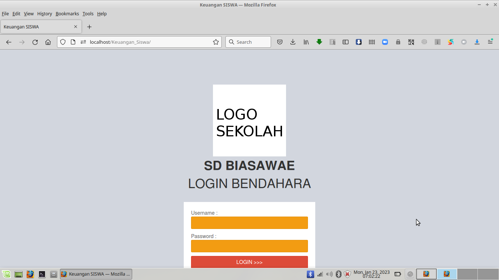
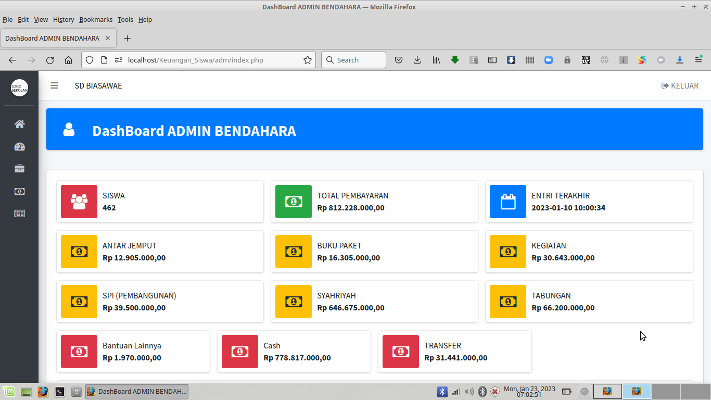
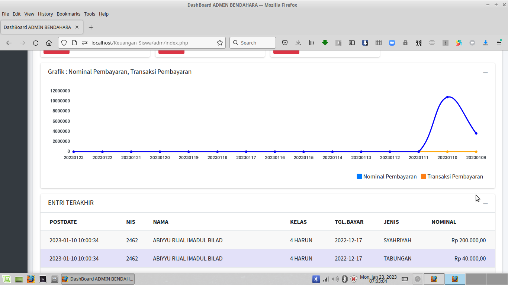
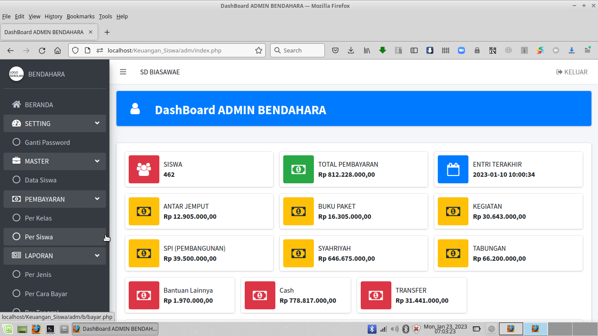
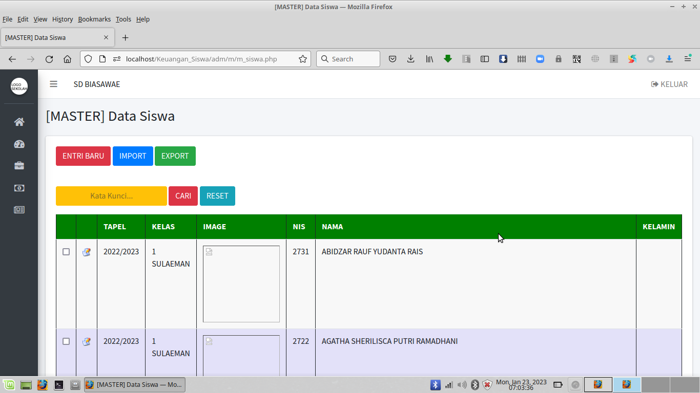
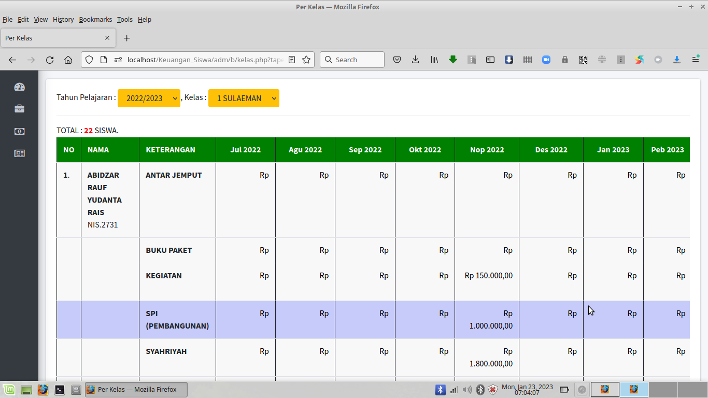
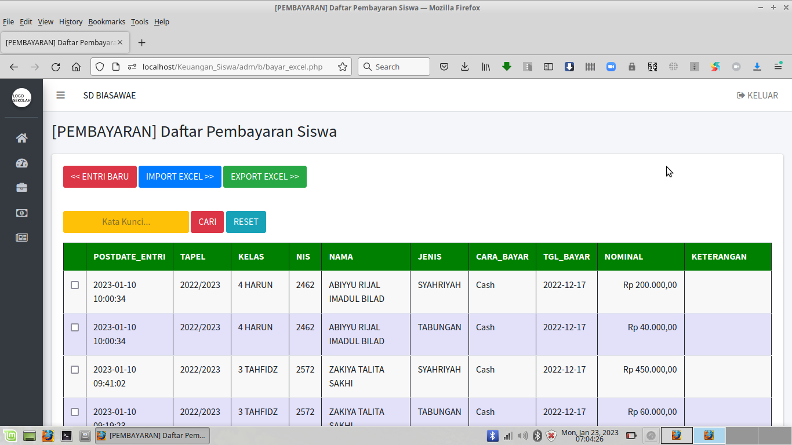
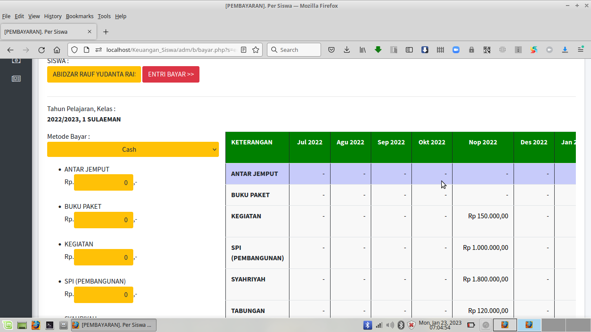

# Keuangan-Siswa v1.0

Keuangan Siswa v1.0 cocok untuk digunakan pada Lingkungan Sekolah : SD, MI, SMP, MTS, SMA, SMK, MA.

Dibuat dengan Php Native Php 7.4.10 dan Mysql/MariaDB.

Pastikan gunakan Webserver XAMPP PHP 7.4.10 .

---

* Untuk File .SQL bisa import dari Folder /db

* File Konfigurasi di /inc/config.php

---

Login Admin, Silahkan gunakan User : admin dan Password : admin

---

TAMPILAN HALAMAN WEB KEUANGAN SISWA :

---

Bila ada kesulitan atau hambatan atau ingin request custom konten berbayar, 

silahkan bisa kontak via email : hajirodeon@gmail.com 

atau WA : 081-829-88-54

